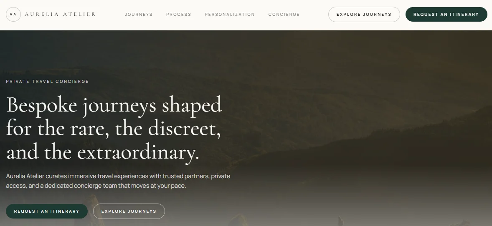

# Aurelia Atelier Travel Landing System

Live Demo  
[https://ramona-dsouza.github.io/tailwind-landing-luxury-travel/](https://ramona-dsouza.github.io/tailwind-landing-luxury-travel/)

## Lighthouse Scores (Desktop)

Performance: 78  
Accessibility: 100  
Best Practices: 96  
SEO: 100  

Measured via Chrome Lighthouse in navigation mode. Performance score reflects high-resolution hero imagery typical of luxury brand experiences.

## Overview

Production-grade luxury travel concierge landing page rebuilt from a legacy static Tailwind project. Designed to reflect an ultra-premium editorial aesthetic while meeting modern standards for accessibility, performance, and deployment simplicity.

## Problem Context

The original repository was a plumbing-branded tutorial project with legacy animation assets, unused dependencies, and limited structural rigor. The objective was to transform it into a bespoke luxury travel experience while preserving a static Tailwind CLI workflow suitable for GitHub Pages deployment. The refactor prioritized modernization, architectural clarity, and production readiness rather than cosmetic redesign.

## Architectural Approach

Static HTML and Tailwind CLI to maximize portability and code transparency. Tokenized design system defined in tailwind.config.js. Semantic HTML5 structure with strict heading hierarchy. Mobile-first responsive grid system. Progressive enhancement for interactive elements. GitHub Pages deployment via the docs folder.

## Key Technical Decisions

- Static-first architecture. Avoided frameworks intentionally to emphasize deploy simplicity, performance, and inspectability.
- Design tokens in configuration. Centralized color palette, typography scale, and spacing rhythm for consistency.
- Minimal JavaScript. JavaScript is limited to the mobile navigation toggle. All motion and layout rely on CSS.
- Performance-conscious assets. Hero image uses fetch priority, non-critical images are lazy-loaded, and explicit dimensions prevent layout shift.
- Accessibility baseline. Skip link, labeled inputs, visible focus states, ARIA only where required, and prefers-reduced-motion compliance.

## Edge Case Handling

Long destination names and testimonial content. Small viewport heights and narrow devices. No-JavaScript fallback behavior. Reduced motion support. Form input resilience through proper types and autocomplete attributes.

## Skills Demonstrated

Design-to-code translation for premium brand experiences. Tailwind design system structuring and refactoring. Accessibility-first semantic markup. Performance optimization and layout stability. Production deployment workflow via GitHub Pages.
